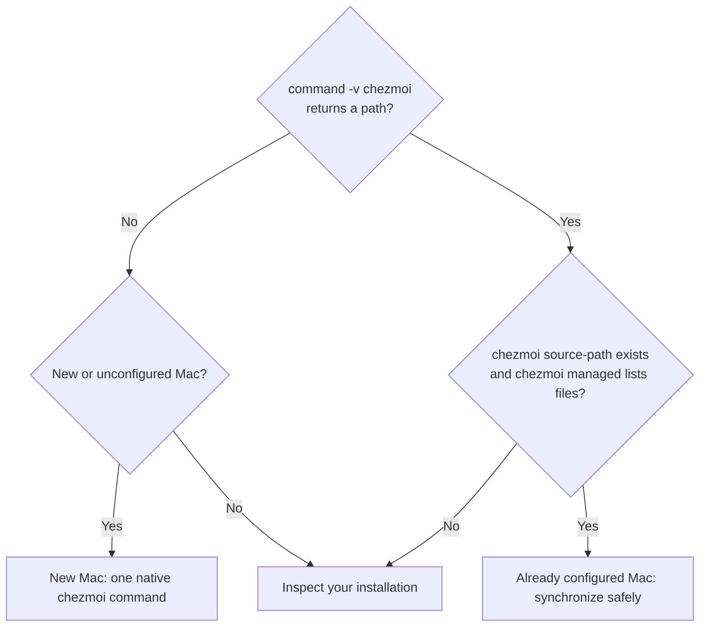

# Set up or synchronize a Mac

[← README](../README.md)

## Which setup case applies?



The commands in the decision nodes are read-only. **Do not run `init --apply` on an existing Mac until its configuration has been inspected and backed up.**

## New Mac: one native chezmoi command

On a **new** Mac, choose your GitHub account and run the [official chezmoi installer](https://www.chezmoi.io/install/):

```sh
export GITHUB_USERNAME="ArthurZakirov"
sh -c "$(curl -fsLS https://get.chezmoi.io)" -- init --apply "$GITHUB_USERNAME"
```

1. If this Mac already has a chezmoi configuration, **stop** and follow [Inspect your installation](#inspect-your-installation) first. Back up `~/.config/chezmoi/chezmoi.toml` before initializing.
2. Run the installer command above. Select **personal** or **professional** when prompted. Approve any expected macOS administrator or Command Line Tools prompts.
3. Open a new Terminal, then verify:

   ```sh
   chezmoi source-path
   chezmoi managed
   chezmoi execute-template '{{ .profile }}'
   ```

4. For the personal profile, configure your Bitwarden Secrets Manager Keychain account separately if needed.
5. If you had a previous `~/.zshrc`, check the backup in `~/Library/Application Support/dotfiles/backups/` before deleting anything.

For the underlying provisioning sequence, see [Architecture](architecture.md).

## Already configured Mac: synchronize safely

1. **Do not rerun the new-Mac installer.** Check the active source and your local Git changes:

   ```sh
   chezmoi source-path
   git -C "$(chezmoi source-path)" status --short --branch
   ```

2. Fetch the latest source changes without applying them. **Only if the working tree is clean:**

   ```sh
   git -C "$(chezmoi source-path)" pull --ff-only
   ```

3. If [`.chezmoi.toml.tmpl`](../home/.chezmoi.toml.tmpl) changed, back up `~/.config/chezmoi/chezmoi.toml`, then run `chezmoi init` (without `--apply`).
4. Review the proposed changes:

   ```sh
   chezmoi diff
   ```

5. **Only when the diff is acceptable**, apply deliberately:

   ```sh
   chezmoi apply
   ```

## Inspect your installation

```sh
chezmoi source-path
chezmoi managed
chezmoi execute-template '{{ .profile }}'
```

If the source path is missing or unexpected, **stop** before applying anything. To change the personal Bitwarden Keychain account, run `chezmoi init --prompt` and review the generated configuration. For implementation details, see [Architecture](architecture.md).
