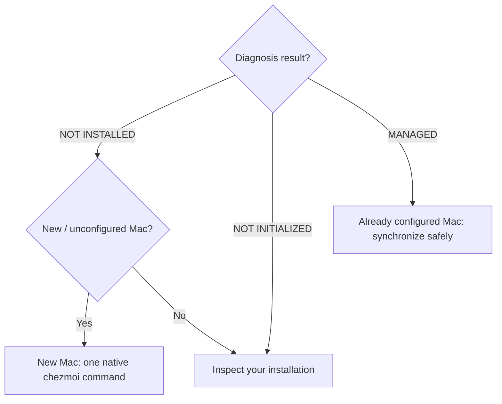

# Set up or synchronize a Mac

[← README](../README.md)

## Which setup case applies?

**Step 1 — Run this read-only diagnosis in Terminal (copy/paste):**

```sh
if ! command -v chezmoi >/dev/null 2>&1; then
  echo 'NOT INSTALLED'
elif ! source_dir="$(chezmoi source-path 2>/dev/null)" || [[ ! -d "$source_dir" ]]; then
  echo 'NOT INITIALIZED'
elif [[ -z "$(chezmoi managed 2>/dev/null)" ]]; then
  echo 'NOT INITIALIZED'
else
  echo 'MANAGED'
fi
```

**Step 2 — Follow the branch matching the printed result:**



**Do not run `init --apply` on an existing Mac until you have inspected and preserved its configuration.**

## New Mac: one native chezmoi command

1. If this Mac already has a chezmoi configuration, **stop** and follow [Inspect your installation](#inspect-your-installation) first. To preserve an existing config before initializing, run:

   ```sh
   config="$HOME/.config/chezmoi/chezmoi.toml"
   if [[ -f "$config" ]]; then
     cp -p "$config" "${config}.backup.$(date +%Y%m%d-%H%M%S)"
   fi
   ```
2. Run the [official chezmoi installer](https://www.chezmoi.io/install/). Select **personal** or **professional** when prompted. Approve any expected macOS administrator or Command Line Tools prompts:

   ```sh
   export GITHUB_USERNAME="ArthurZakirov"
   sh -c "$(curl -fsLS https://get.chezmoi.io)" -- init --apply "$GITHUB_USERNAME"
   ```
3. Open a new Terminal, then verify:

   ```sh
   chezmoi source-path
   chezmoi managed
   chezmoi execute-template '{{ .profile }}'
   ```

4. For the personal profile, configure your Bitwarden Secrets Manager Keychain account separately if needed.
5. If you had a previous `~/.zshrc`, check the backup in `~/Library/Application Support/dotfiles/backups/` before deleting anything.

For the underlying provisioning sequence, see [Architecture](architecture.md).

## Already configured Mac: synchronize safely

1. **Do not rerun the new-Mac installer.** Check the active source and your local Git changes:

   ```sh
   chezmoi source-path
   git -C "$(chezmoi source-path)" status --short --branch
   ```

2. Fetch the latest source changes without applying them. **Only if the working tree is clean:**

   ```sh
   git -C "$(chezmoi source-path)" pull --ff-only
   ```

3. If [`.chezmoi.toml.tmpl`](../home/.chezmoi.toml.tmpl) changed, save a timestamped copy of the current local config (if it exists), then regenerate it **without applying**:

   ```sh
   config="$HOME/.config/chezmoi/chezmoi.toml"
   if [[ -f "$config" ]]; then
     cp -p "$config" "${config}.backup.$(date +%Y%m%d-%H%M%S)"
   fi
   chezmoi init
   ```

   Check the generated file against the backup before continuing.
4. Review the proposed changes:

   ```sh
   chezmoi diff
   ```

5. **Only when the diff is acceptable**, apply deliberately:

   ```sh
   chezmoi apply
   ```

## Inspect your installation

```sh
chezmoi source-path
chezmoi managed
chezmoi execute-template '{{ .profile }}'
```

If the source path is missing or unexpected, **stop** before applying anything. To change the personal Bitwarden Keychain account, run `chezmoi init --prompt` and review the generated configuration. For implementation details, see [Architecture](architecture.md).
